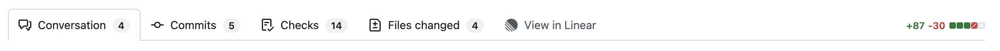

# GitHub PR → Linear Review

Chrome extension that adds a **"View in Linear"** tab to GitHub pull request pages, next to "Files changed".



Clicking it opens the matching Linear review in a new tab.

Linear's review URL mirrors the GitHub repo path verbatim, so the tab is just a
direct link — no lookup, no reviewer self-assign, no config:

```
github.com/owner/repo/pull/123  →  linear.app/review/owner/repo/pull/123
```

Linear redirects that to the canonical opaque-slug review.

## Install

```sh
npm install
npm run build
```

Then in Chrome: `chrome://extensions` → enable Developer mode → **Load unpacked** → select the `dist/` folder.

## Develop

```sh
npm run watch   # rebuild on change; reload the extension in chrome://extensions
```

## How it works

- `src/github.ts` — content script on github.com. Injects the tab (handling GitHub's SPA navigation), pointing it at `linear.app/review/<owner>/<repo>/pull/<n>`.

## Known fragility

- Tab injection anchors off the "Files changed" tab markup; if GitHub changes it, the tab won't appear.
